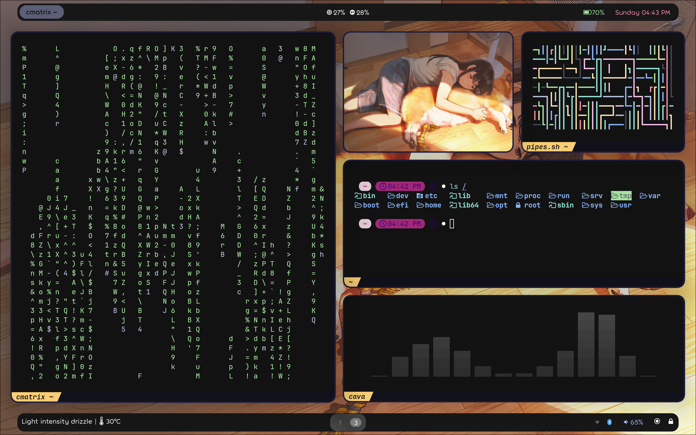

# dotfiles
Setting Up my workflow in a jiffy :)



## Hyprland Only works on Arch Linux, and other Rolling Releases with bleeding-edge like OpenSuse, Fedora, etc...

## Software requirements/dependencies
Install these first
```
paru -S hyprland-git kitty waybar-hyprland-git swww swaylock-effects wofi wlogout mako xdg-desktop-portal-hyprland-git swappy grim slurp thunar pamixer pavucontrol brightnessctl network-manager-applet gvfs thunar-archive-plugin file-roller pacman-contrib ttf-jetbrains-mono-nerd noto-fonts-emoji lxappearance xfce4-settings --needed
```

## Now paste all the folders inside `~/.config/`
