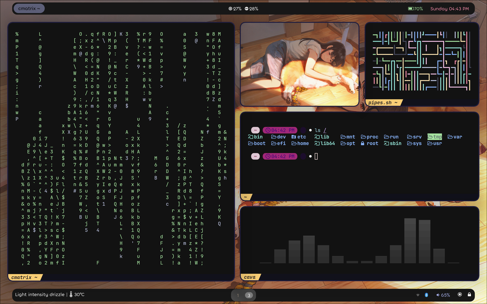

# dotfiles
> Modernity Branch



> :warning: **Dependencies:**

```
hyprland kitty lsd doas swww swaylock-effects wlogout xdg-desktop-portal-hyprland swappy grim slurp pamixer pavucontrol brightnessctl network-manager-applet gvfs gvfs-smb nautilus gnome-clocks gnome-music file-roller ttf-jetbrains-mono-nerd noto-fonts-emoji pywal-git pywal-discord-git coreutils curl fish yad fuzzel gjs gnome-bluetooth-3.0 gnome-control-center gnome-keyring gobject-introspection grim gtk-layer-shell libdbusmenu-gtk3 meson networkmanager nlohmann-json npm plasma-browser-integration playerctl ripgrep sassc swayidle typescript upower xorg-xrandr webp-pixbuf-loader wireplumber tesseract ydotool adw-gtk3 aylurs-gtk-shell cava gojq gradience lexend-fonts-git python-material-color-utilities python-poetry python-build python-pillow ttf-material-symbols-variable-git 

```

> :memo: **Installation:**

> :lightbulb: **Zen Programmer Setup**
- Setup [zsh](https://dev.to/andrenbrandao/terminal-setup-with-zsh-tmux-dracula-theme-48lm)
- Setup [tmux](https://www.josean.com/posts/tmux-setup)

> :bulb: **Attributions**

- Thanks to [@end-4](https://github.com/end-4) for the ags setup!
- Thanks to the [zsh](https://www.zsh.org/) community!
- Thanks to [@josean-dev](https://github.com/josean-dev) for tmux tutorial!
