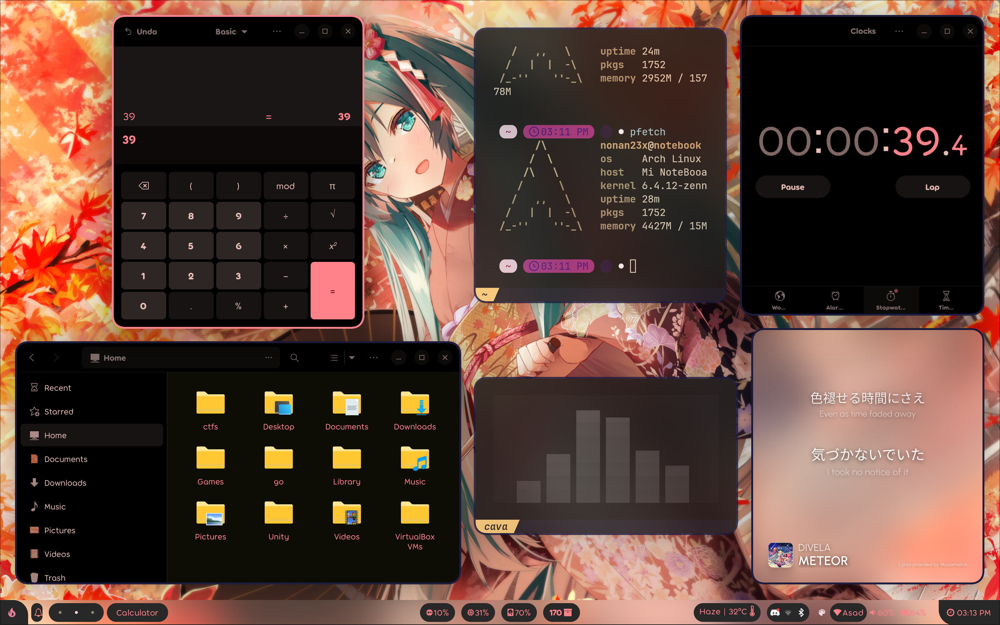

# dotfiles



### Software requirements/dependencies

dependencies

Using paru as a AUR helper
```
paru -S hyprland-git kitty waybar-hyprland-git swww swaylock-effects wofi wlogout mako xdg-desktop-portal-hyprland-git swappy grim slurp thunar pamixer pavucontrol brightnessctl network-manager-applet gvfs thunar-archive-plugin file-roller ttf-jetbrains-mono-nerd noto-fonts-emoji lxappearance --needed
```
The above dependencies assume that you already have a working and configured Arch Linux system, with atleast one Wayland Desktop Environment or Window Manager configured.

### Installation
`./install.sh`

### Credits
Thanks to [@linuxmobile](https://github.com/linuxmobile) for some of the configs that I use
